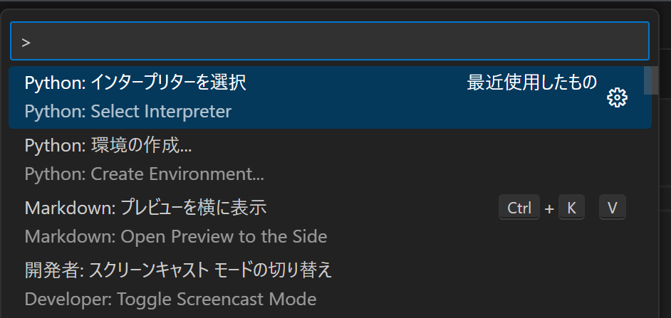

# 仮想環境の構築手順

1. 大元のフォルダを作成
2. そのフォルダをVScodeで開く
3. ターミナルで以下のコードを入力  
   `py -m venv .venv`
4. `ctrl`+`Shift`+`P`で`Python: インタープリターを選択`で仮想環境を選択  
   
5.  `.gitignore`を作成
6.  大元のフォルダの直下に作りたいプロジェクトを作成

---

[README](../README.md)